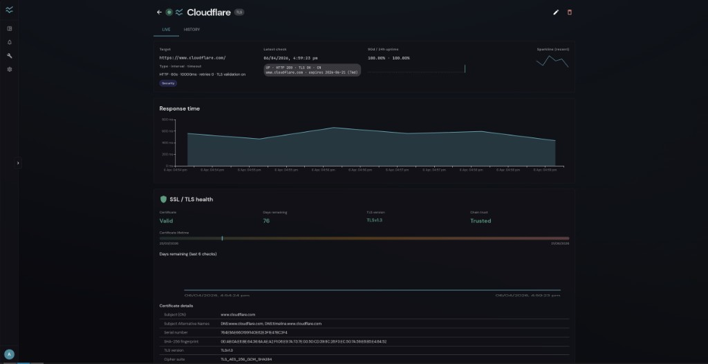
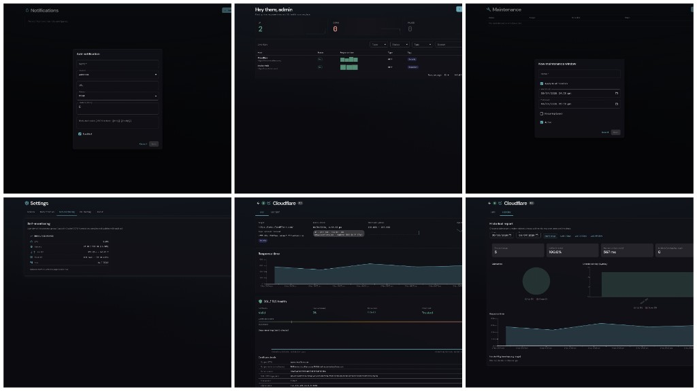

# Pulsebeat

**Pulsebeat** is a self-hosted uptime and health console for the services you care about. Watch HTTP, TCP, ping, and DNS targets from one place: a fast **dark, glass-style UI**, **SSL/TLS insight** for HTTPS checks, **tags and filters**, **maintenance windows** that silence alerts during planned work, and **notification channels** (including webhooks) so your team hears about incidents on your terms.

Run it at home, on a VPS, or in Docker — your data stays **yours**, in a **SQLite** database you control.

<p align="center">
  
</p>
<p align="center">
  
</p>

---

## Highlights

- **Dashboard** — At-a-glance status, response-time strips, and quick actions (including on-demand checks).
- **Monitor detail** — Live metrics plus a **historical report** with date ranges and charts for trends and incidents.
- **Alerts** — Wire up Telegram, email, Discord, Slack, custom webhooks, and more.
- **Maintenance** — Schedule windows so checks still run but alerts stay quiet.
- **Settings** — Tune defaults, retention, SSL alerting, optional **container/self-monitoring** stats, and **About** metadata.

Access is **password-protected** with **JWT** sessions (`httpOnly` cookies); the same API can be used with `Authorization: Bearer` for automation.

---

## Quick start (Docker)

The official image serves the **web UI and REST API** on **port 4141** from a single process.

1. **Clone** this repository (or use your own compose file pointing at the image).
2. **Copy** environment defaults: `cp .env.example .env`
3. **Set** at least **`PULSEBEAT_JWT_SECRET`** (16+ characters). **Set** **`PULSEBEAT_ADMIN_PASSWORD`** if you want a known initial `admin` password; otherwise the first boot logs a **one-off random password**.
4. **Start**:

   ```bash
   docker compose up --build -d
   ```

5. Open **http://localhost:4141**, sign in, and add your first monitor.

Persistent data lives in **`./data`** on the host by default (`pulsebeat.db`). The image supports **linux/amd64** and **linux/arm64** (for example Raspberry Pi).

**Image (Docker Hub):** `kaminostream/pulsebeat:latest` — `docker pull kaminostream/pulsebeat:latest`

---

## Development

From the repository root:

```bash
npm install
npm run dev
```

- **UI (Vite):** [http://localhost:5173](http://localhost:5173) — proxies `/api` to the API (cookies are forwarded).
- **API:** [http://localhost:4141](http://localhost:4141)

Set **`PULSEBEAT_JWT_SECRET`** in `.env` (≥16 characters) for a stable secret. If you omit it in development, a built-in dev secret is used (**not** for production).

**First run (no users yet):** a default account is created:

- Username: **`admin`** (override with `PULSEBEAT_ADMIN_USER`)
- Password: **`changeme`** in development if `PULSEBEAT_ADMIN_PASSWORD` is unset; in production, if unset, a **random password is printed once** in the server logs — or set `PULSEBEAT_ADMIN_PASSWORD` in `.env` explicitly.

Production-style local run:

```bash
npm run build
npm run start
```

Then open [http://localhost:4141](http://localhost:4141) and sign in.

---

## Behind a reverse proxy or custom domain

If the browser origin and API origin differ, or you see **Content-Security-Policy** / **connect-src** issues, set **`PULSEBEAT_ALLOWED_ORIGINS`** to a comma-separated list of full origins (scheme + host, no path), e.g. `https://pulsebeat.example.com`. That feeds **CSP `connect-src`** and **credentialed CORS** for `/api`. If another layer injects a stricter CSP, adjust it there — Pulsebeat cannot override headers added in front of the app.

---

## Versioning and changelog

- Canonical changelog: **`CHANGELOG.md`** at the repo root.
- Copies are synced to **`client/public/`** and **`server/`** when you run `npm run dev`, `npm run build`, or `npm run sync-changelog`.
- For releases, bump **`version`** in the root **`package.json`**, **`client/package.json`**, and **`server/package.json`** together, then add a new section to **`CHANGELOG.md`**.

---

## Licence

See [LICENSE](LICENSE).

---

## Support

If you find Aura useful, consider buying me a coffee.

[](https://ko-fi.com/xykheel)
